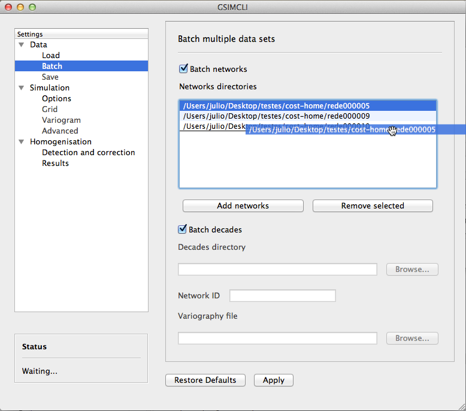

.. _gui:

Graphical user interface manual
###############################

:Date: |today|

This document aims to get you used to the gsimcli's graphical user interface
(GUI).
It is divided into sections that more or less match the interface sections.

The interface was designed to be easy and intuitive to use, having a lot of
common structures seen in other programs.

.. contents::
    :depth: 3
    :backlinks: top

Overview
********

The main window is divided into four sections, as shown in the figure
`below <fig_overview_>`_:

* on top (depending on the operating system) there is the **main menu**;
* all the homogenisation process **settings** are accessed on the left menu;
* below the left menu, on the bottom left corner, there is the **status box**;
* the remaining area on the right is where the settings are shown.

.. _fig_overview:

   
   Overview of the graphical user interface
   
There are two auxiliary buttons on the main window:

* **Apply** will save the current settings.
* **Restore Defaults** will change all settings to the default values (not
  implemented yet).

Main menu
*********

The main menu includes a few other subsections. When available, the actions
listed in the main menu may be followed by a keyboard shortcut, as illustrated
in the :ref:`fig_menu`.

.. _fig_menu:

   
   Main menu example
   
   It shows the `File`_ menu options and their keyboard shortcuts.

File
====

From here you can read and write files.

Restore last session
--------------------

Reload all the settings used in the last session (if any).

Open settings file
------------------

Load all the settings saved into a configuration file. The file extension
depends on your operating system and it should be automatically detected.

Recent settings files
---------------------

List the last 10 configuration files which were opened or saved and it will
load all the settings saved in the selected file.

Save settings
-------------

Save the current settings into the configuration file previously loaded.

.. warning:: it will not overwrite the settings file previously loaded, for
    that purpose you should use `Export settings`_. This behaviour is expected
    to change in a future version.

Export settings
---------------

Save the current settings into a new configuration file.

Quit
----

Exit from the application.

View
====

Print status (console)
----------------------

Enable or disable the program output into the console (terminal emulator).
If any error occur while running the application, it will be printed in
the console regardless of this option.

Tools
=====

Not implemented yet.

Run
===

GSIMCLI
-------

Start the homogenisation process with the current settings. The process
progress will be stated in the status box.

Help
====

Online documentation
--------------------

This is a link to the online documentation, which should open in your browser.

About
-----

Some information about the application.

Settings
********

This GUI basically serves the purpose of preparing and launching the GSIMCLI
homogenisation process. This process depends on several settings which are
user adjustable.

There are three groups of settings for you to set up: `Data`_,
`Simulation`_ and `Homogenisation`_.

Data
====

In this group you set up the data to be homogenised.

Load
----

Options to load a single data file and set the specifications of the chosen
file (or of multiple files with the same format).

.. _fig_dataload:

   
   Example of the **Data/Load** settings pane
   
   In this example, a single data file was loaded, and it has 7 header lines,
   as seen in the preview area. The data set name was automatically detected
   from the first header line and the variables order is being adjusted
   (*drag and drop*).

Data file location
^^^^^^^^^^^^^^^^^^

Browse a single file containing the data set. This option is automatically
disabled if `Batch`_ is enabled.

.. _header:

Header
^^^^^^

Enable if every data file has header lines as the standard specified in the
`GSLIB format`_.

File preview
^^^^^^^^^^^^

Show the first 10 lines of the loaded file. It is useful to double check
the existence of header lines and the variables order.

When processing multiple networks, it will try to locate one of the data
files of the selected network and display its first 10 lines.

Name
^^^^

The data set name. If `header`_ is enabled, it will automatically
extract the first line of the data file into this field, but it will remain
editable.

Variables
^^^^^^^^^

Select the correct variables order, which should match the structure of the
given data files. You can adjust their order through *drag and drop*. There
are five default variables that your data file should include:

:x: value for the X-coordinate.
:y: value for the Y-coordinate.
:time: value for the unit of time (e.g., year).
:station: the station ID number.
:clim: value for the climate variable.

The `previous example <fig_dataload_>`_ shows the preview of a loaded data file
and the matching (*drag and drop*) of the variable corresponding to the station
ID.

No data
^^^^^^^

The numeric placeholder for missing data. The default value is ``-999.9``.

Batch
-----

Depending on the size of the data set and on the selected settings, the
homogenisation process may take a few hours or even several days. These batch
options allow you to prepare different networks and leave them to run as on a
queue list.

.. _fig_databatch:

   
   Example of the **Data/Batch** settings pane
   
   In this example, three networks were selected and the order in which they
   are going to be homogenised is being changed (the network *rede000005* will
   be the last one).
   
   The options below :ref:`batch_decades` are grayed out because
   :ref:`batch_networks` is enabled.

.. _batch_networks:

Batch networks
^^^^^^^^^^^^^^

This option allows you to select multiple networks to homogenise. Each
network data set must follow a specific format and must have a main folder with
a (meaningful) identification name/number, which contains:

* a file with the grid properties, this file name must be of the type
  ``*grid*.csv``;
* as of **version 0.0.1**, it is mandatory that :ref:`batch_decades` is
  enabled and thus its requirements must also be followed;
* a folder which name starts with ``*dec*`` (e.g., decades or dec_files);
* a variogram file within it, and this file name must be of the type
  ``*variog*.csv``.

The file with the grid properties must follow these specifications:

- comma separated values (CSV)
- seven labelled columns (not case sensitive):

    - **xmin:** initial value in X-axis
    - **ymin:** initial value in Y-axis
    - **xnodes:** number of nodes in X-axis
    - **ynodes:** number of nodes in Y-axis
    - **znodes:** number of nodes in Z-axis
    - **xsize:** node size in X-axis
    - **ysize:** node size in Y-axis
    - other columns will be ignored

After enabling this option, the buttons to add and remove networks become
available.

Press the button **Add networks** to select the main directories of the
networks to be homogenised. You can select multiple folders (networks) at
the same time by pressing *CTRL* (PC) or *CMD* (Mac) while selecting them.

After adding networks to the queue list, you can remove one or multiple
networks from the list by selecting them and pressing the button
**Remove selected**. Also, if you select one of the networks in that list, one
of its data files will be previewed in the `File preview`_ area.

It is also possible to change the order in which the networks will be
processed by *drag and dropping* from the list, as seen in the
:ref:`fig_databatch`.

.. note:: when :ref:`batch_networks` is enabled, the settings menu to set up
    the simulation `Grid`_ automatically becomes unavailable, you have to
    specify the grid through a spreadsheet file.
    
.. warning:: it is only working if :ref:`batch_decades` is also enabled. For
    that reason, the grid is assumed to have 10 nodes of size 1 in the Z-axis
    (10 years). 

.. _batch_decades:    

Batch decades
^^^^^^^^^^^^^

It might be useful to process a time series in chunks of time, for
instance, if your data set spans a full century, splitting the data in
decades may help to analyse local (temporal) trends or irregularities, or
it just can ease the computational weight.

In order to enable this option, the following requirements must be
followed:

* your data set files must be placed inside the folder;
* the decadal data files must have, at least, the first year of each decade
  in their file names;
* you should provide a spreadsheet file with the theoretical variogram
  model.

The variograms file must follow these specifications:

- comma separated values (CSV)
- nine labelled columns (not case sensitive):

    - **variance:** the data variance per decade
    - **decade:** decade in the format aaXX-aaYY (*aa* is optional)
    - **model:** 'S', 'E' or 'G' (S = spherical, E = exponential, G = gaussian)
    - **nugget:** nugget effect
    - **range** the variogram range
    - **partial sill**
    - **nugget_norm:** variance-normalised nugget effect
    - **psill_norm:** variance-normalised partial sill
    - **sill_norm:** variance-normalised total sill
    - other columns will be ignored

.. note:: The variogram is assumed to be isotropic in the horizontal direction
    and with range 1 (one unit) in the vertical (time) direction. It will
    default its angles to (0, 0, 0).

After enabling this option, the related areas become available, except if
:ref:`batch_networks` is also enabled, in which case it is not necessary to
specify anything else.

If not processing multiple networks, the following fields must be filled:

* **Decades directory:** the folder containing your decadal files.
* **Network ID:** the network ID name/number. The program will try to guess the
  ID from the decades directory, but you can change it after that.
* **Variography file:** the spreadsheet file containing the variogram model.

.. note:: when :ref:`batch_decades` is enabled, the settings' menu to set up
    the `Variogram`_ automatically becomes unavailable, you have to specify
    the variogram through a spreadsheet file.
    
Save
----

This section is about the specifications of the resulting homogenised data set,
but is not implemented yet. Please see the section `Results`_ which contains
some options regarding the homogenisation process resulting files.

Simulation
==========

The gsimcli homogenisation process is based on a geostatistical stochastic
simulation method. It is necessary to specify several options related to that
part of the process, however, a set of default values are provided in the GUI.
Also, the less relevant [to the homogenisation process] simulation parameters
are conveniently hidden and placed in a section for `Advanced`_ settings.

Options
-------

.. _fig_simopt:

   
   Example of the **Simulation/Options** settings pane

Parameters file
^^^^^^^^^^^^^^^

The simulation parameters file, in its original format. As of
**version 0.0.1**, that file will be automatically generated, and this field is
disabled.

Executable file
^^^^^^^^^^^^^^^

The simulation (Direct Sequential Simulation -- DSS) binary file. As of
**version 0.0.1**, only the 2001 version is supported. You can get the
binary from the `CMRP Software`_ site. Download the file *GeoMS.zip*
and extract the binary *dssim.exe*.

Number of simulations
^^^^^^^^^^^^^^^^^^^^^

The number of simulations per candidate station. A brief study demonstrated
that a higher number leads to better results, as it will produce a smoother
local distribution. A low number (below 100) will produce a distribution
with *artifacts*, while a number too high will require too much CPU time.
We advise you to run the process with a few hundreds (e.g., 500)
realisations per candidate station.

Krigging type
^^^^^^^^^^^^^

The krigging estimator used while simulating each node:

* Ordinary (OK)
* Simple (SK)

Maximum number of nodes to be found
^^^^^^^^^^^^^^^^^^^^^^^^^^^^^^^^^^^

Related to the search method.

We advise the value 16, in the range 1 -- 64. A higher number will produce
a better spatial correlation in the simulated maps but it will demand an
unnecessary higher computational effort. We found that a value above 16
would not bring enough benefits to justify the increasing CPU time.

The remaining parameters related to the search method are defined by default,
as we tested them and found these values to be a good starting point. Those
parameters are:

* **Search strategy:** data nodes (do not search for real and simulated data
  separately).
* **Grid search method:** spiral search (search for the nearest nodes according
  to a spiral pattern).
* **Search radius:** equal to the given grid dimensions.
* **Number of samples**, **Samples per octant**, and **Search angles**, are
  irrelevant for the data nodes search strategy.

Number of CPU cores
^^^^^^^^^^^^^^^^^^^

Recent computers often have multiple central processing units (CPU's) or
one CPU with multiple cores, where each of them can be assigned to run a
different process at the same time.

In this program, such technology can be used to speed up the overall
process. Specifically, you can opt to run multiple simulations at the same
time if your computer has that capability, instead of running one at a
time.

The program will detect the number of cores installed and select that value
by default. In the :ref:`fig_simopt`, the program detected the maximum number
of 2, which corresponds, in this case, to a CPU with two processor cores.

.. note:: The parallelised DSS version is not supported. The multi-threading
    is attained through a script that will prepare and launch a number of
    copies of the DSS binary equal to the given number of CPU cores, which, in
    fact, may be more efficient than the parallelised version, because only
    some specific parts of the algorithm will run in parallel mode.

.. _skip:

Skip simulation and use simulated maps already in place
^^^^^^^^^^^^^^^^^^^^^^^^^^^^^^^^^^^^^^^^^^^^^^^^^^^^^^^

Enable this option if you have already run all the simulations and have
kept the resulting maps in the results folder.

This option is useful for debugging purposes or if you need to rebuild the
results file.

Grid
----

Here you specify the simulation grid:

* Grid dimension: the number of nodes/cells in each direction.
* Cell size: the length (in units of distance) of one side of each cell (which
  are squared).
* Origin coordinates: the position (in units of distance) of the first cell.

.. note:: The Z-axis corresponds to time.

This section will be automatically disabled when :ref:`batch_networks` is
enabled.

.. _fig_simgrid:

   
   Example of the **Simulation/Grid** settings pane
   
   In this example, the data set is displayed in a regular grid of
   :math:`170 \times 250 = 42500` nodes, covering a total area of
   :math:`42500 \times 500 \times 500 = 10625 \times 10^6` units of area. That
   time series spans the decade of 1980 to 1989 (10 nodes of size 1 in the
   Z-axis).
   

Variogram
---------

In this screen there are the necessary fields to set up the theoretical
variogram model:

* Model (Spherical, Exponential or Gaussian)
* Nugget effect (normalised)
* Sill (normalised)
* Ranges (three comma separated values)
* Angles (three comma separated values)

This section will be automatically disabled when :ref:`batch_decades` is
enabled.

.. _fig_simvar:

   
   Example of the **Simulation/Variogram** settings pane
   
   This corresponds to an isotropic variogram, assuming no continuity in the
   temporal axis (which makes sense for annual data sets).

Advanced
--------

Options to change the remaining DSS parameters. Not implemented yet.

Homogenisation
==============

The homogenisation process may be divided into two major steps: the detection
of irregularities and then their correction.

In gsimcli method, the simulation plays an import role in the detection of
irregularities, but there are a few more parameters that can be adjusted,
regarding on the way the simulation is embedded in the homogenisation process.

Detection and correction
------------------------

A breakpoint is identified whenever the interval of a specified probability
`p` (e.g., 0.95), centred in the local PDF, does not contain the observed
(real) value of the candidate station. In practice, the local PDF's are
provided by the histograms of simulated maps. Thus, this rule implies that
if the observed (real) value lies below or above the predefined
percentiles of the histogram, of a given instant in time, then it is not
considered homogeneous.

If irregularities are detected in a candidate series, the time series can be
adjusted by replacing the inhomogeneous records with the mean, or median, of
the PDF(s) calculated at the candidate station’s location for the inhomogeneous
period(s) [COSTA2009]_ (with time, different methods of correction may be
introduced).

.. _fig_homdet:

   
   Example of the **Homogenisation/Detection and correction** settings pane
   

Candidates order
^^^^^^^^^^^^^^^^

The order in which the candidates stations will be homogenised. There are
a few options to arrange all stations in different manners, or you can
provide your own arrangement.

The available options to sort the candidate stations are:

* ID order: according to the stations' ID name/number.
* Network deviation: according to the difference between the station
  average and the network average.
* Random: all stations randomly sorted.
* Variance: sorts all stations by greater or lower variance.
* User: the user specifies which stations will be homogenised and their
  order.

If you select **User**, the stations' IDs will be automatically detected
and listed. Then, you can reorder them by *drag and drop*, remove any that is
not to be homogenised by pressing **Remove selected**, or reset the list
to its original state by pressing **Reset stations** (see the
`example above <fig_homdet_>`_).

.. note:: That stations list will only appear if you have enabled
    :ref:`batch_networks` and only one network have been added.

Ascending order
^^^^^^^^^^^^^^^

You also can specify if this sorting is done in ascending or descending
order. For instance, for the **Variance** sorting method, if you disable
**Ascending order**, it will sort all stations by greater variance (which is
the default option).

Missing data last
^^^^^^^^^^^^^^^^^

If a station has no data in the time period being processed, you can opt to
homogenise that station in the first place, or only after the remaining
candidate stations.

Detection probability
^^^^^^^^^^^^^^^^^^^^^

Probability value to build the detection interval centred in the local PDF.

Correction method
^^^^^^^^^^^^^^^^^

The method for the inhomogeneities correction:

* Mean: replace detected irregularities with the mean of simulated values.
* Median: replace detected irregularities with the median of simulated
  values.
* Skewness: use the sample skewness to decide whether detected
  irregularities will be replaced by the mean or by the median of simulated
  values. If selected, a new field will appear for you to define the
  skewness threshold.
* Percentile : depending on the irregularities being located in the lower or
  upper tail, they will be replaced with the percentile ``(1-p)/2`` or
  ``1-(1-p)/2``, respectively, for a given ``p`` (the
  `picture below <fig_pdfperc_>`_ shows an example). If selected, a new field
  will appear for you to define the value of ``p`` (see the interface
  `example above <fig_homdet_>`_).

.. _fig_pdfperc:

Results
-------

The homogenisation process ends with its results being saved into a spreadsheet
file. Also, there are other files generated in the process which the user can
opt to save or purge them when they are no longer needed.

.. _fig_homres:

.. figure:: ../images/gui-hom-res.png
   :alt: Example of the Homogenisation/Results settings pane
   
   Example of the **Homogenisation/Results** settings pane

Save intermediary files
^^^^^^^^^^^^^^^^^^^^^^^

Save generated files in the procedure: intermediary PointSet files
containing candidate and reference stations, homogenised and simulated
values, and DSS parameters files.

If you :ref:`skip` then this option is forcibly enabled.

.. _purge:

Purge simulated maps
^^^^^^^^^^^^^^^^^^^^

Remove all simulated maps after the homogenisation of each candidate
station. In this way, the required disk space in your computer is highly
reduced, but it will not be possible to analyse the simulation results
afterwards.

Results file and directory
^^^^^^^^^^^^^^^^^^^^^^^^^^

Select the directory and file which will contain the homogenisation results.
You can write the full directory on the left field and the file name on the
right field, or you can press the **Browse...** button to navigate to the
desired location and name the results file.

The selected directory will also be the destination folder for the
intermediary and other resulting files.

If :ref:`batch_networks` is enabled, the **Browse...** button will open a
dialog for you to choose a directory (and not a file). Then you will have
to write a name for the results file on the right field. The programm will
automatically write the file extension (``*.xls``). Also, in this case, the
final results directory will be the selected one plus a folder with each
network name.

Hard drive requirements
^^^^^^^^^^^^^^^^^^^^^^^

In this area is shown the necessary and the available disk space.

The required disk space is estimated and considers only the simulated map files
(the remaining files do not have a significant size). This value will be
calculated (and updated) as soon as all the other settings are set up (you may
have to press the **Apply** button to update this value).

The available disk space is shown after the results directory is selected.

In case of insufficient available disk space, please try to enable the
option to :ref:`purge`. For instance, in the `given example <fig_homres_>`_,
disabling that option would increase the necessary disk space to more than 30
GB.

Bibliography
************

.. [COSTA2009] Costa, A., & Soares, A. (2009). Homogenization of climate data
    review and new perspectives using geostatistics. Mathematical Geosciences,
    41(3), 291–305. doi:10.1007/s11004-008-9203-3

References
**********

.. target-notes::

.. _`GSLIB format`: http://www.gslib.com/gslib_help/format.html
.. _`CMRP Software`: https://sites.google.com/site/cmrpsoftware/geoms
